<!--
// Copyright 2016 ChaiShushan <chaishushan{AT}gmail.com>. All rights reserved.
// Use of this source code is governed by a BSD-style
// license that can be found in the LICENSE file.
-->

<!-- ++++++++++++++++++++++++++++++++++++++++++++++++++++++++++++++++++++++  -->

<!-- *** 横向分隔, --- 竖向分隔, Note: 讲稿注释  -->

<!--
Reveal.js 可能会需要 AJAX 异步加载 Markdown 文件, 可以在当前目录启动一个 http 服务.

以下是常见的临时启动 http 服务器的方式:

	NodeJS
	npm install http-server -g
	http-server

	Python2
	python -m SimpleHTTPServer

	Python3
	python -m http.server

	Golang
	go run server.go

启动后, 本地可以访问 http://127.0.0.1:port, 其中 port 为端口号, 命令行有提示.

幻灯片操作: F键全屏, S键显示注解, ESC大纲模式, ESC退出全屏或大纲模式, ?显示帮助

-->

<!-- ++++++++++++++++++++++++++++++++++++++++++++++++++++++++++++++++++++++  -->

# Emscripten简介

<h4 style="text-align:center;">
	<a href="https://github.com/chai2010" target="_blank">
		chaishushan@gmail.com
	</a>
</h4>

----

#####  <!-- .element: style="width:80%;" -->


<!-- ++++++++++++++++++++++++++++++++++++++++++++++++++++++++++++++++++++++  -->
***

## Emscripten是什么?
-------------------

##### 将C/C++代码转为JavaScript代码的工具.

##### 类似的工具还有Cheerp(商业软件), 支持C++类.

##### 其它语言: GWT, Dart, TypeScript, CoffeeScript, ...

----

#### http://emscripten.org

#### https://github.com/kripken/emscripten

---

### 工具链
---------

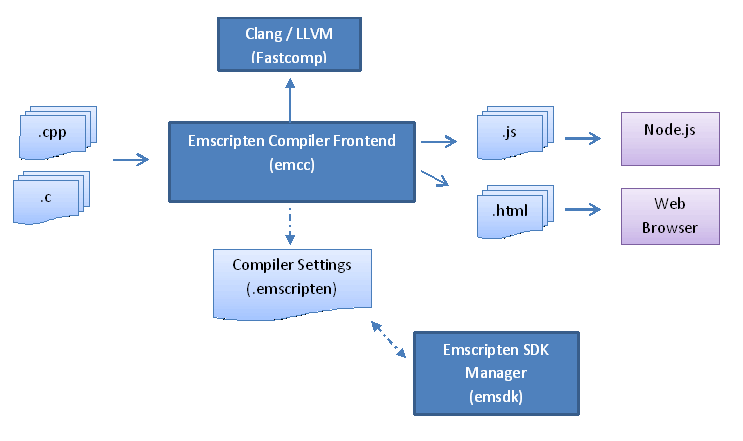 <!-- .element: style="width:100%; height:500px;" -->

---

### JS转换流程
-------------

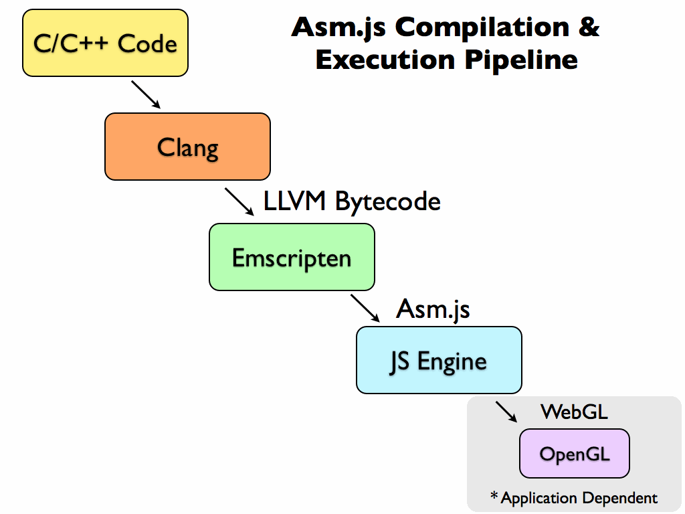 <!-- .element: style="width:100%; height:500px;" -->

---

### 性能对比
-----------

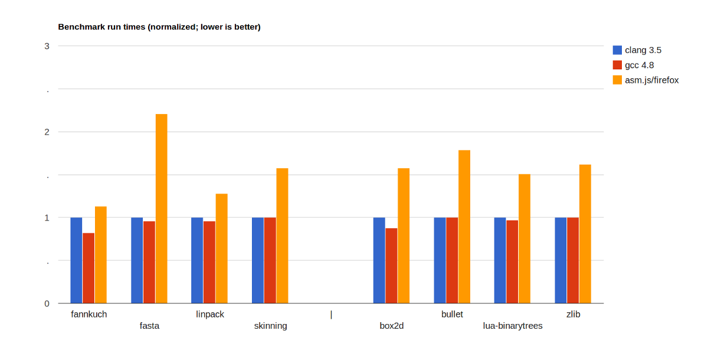 <!-- .element: style="width:100%;" -->

---

### [下载Emscripten](http://kripken.github.io/emscripten-site/docs/getting_started/downloads.html)
----------

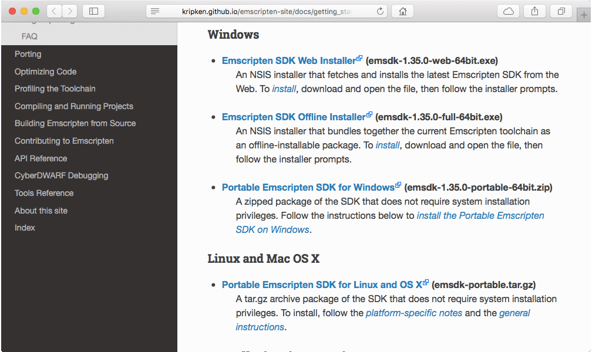 <!-- .element: style="width:100%; height:500px;" -->

---
### 安装Emscripten(Windows)
-------------------------

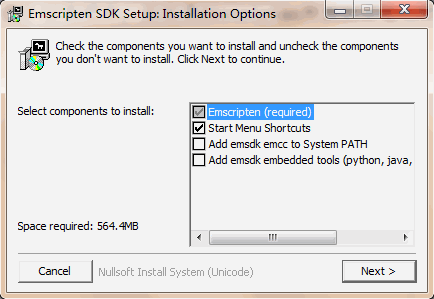 <!-- .element: style="width:48%; height:500px;" --> 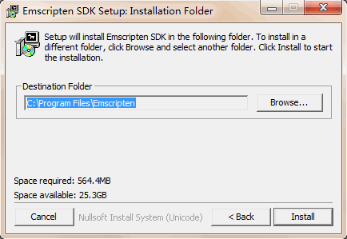 <!-- .element: style="width:48%; height:500px;" -->

---
### 安装Emscripten(Docker)
-------------------------

```
$ docker run --rm -it -v `pwd`:/src apiaryio/emcc emcc
$ docker run --rm -it -v `pwd`:/src apiaryio/emcc:1.38.11 emcc
```

------

- Docker环境切换emcc版本比较方便

<!-- ++++++++++++++++++++++++++++++++++++++++++++++++++++++++++++++++++++++  -->
***

## 你好, 世界!
-------------

hello.cc:

```c++
#include <stdio.h>

int main() {
	printf("你好, 世界!\n");
	return 0;
}
```

编译运行:

```
$ emcc hello.cc
$ node a.out.js
你好, 世界!
```

---
### 你好, 世界! - 构造HTML5页面
----------------------------

指定输出的文件名:

```
emcc hello.cc -o index.js
```

构造HTML5页面(省略了html/head/body标签):

```html
<!DOCTYPE HTML>

<title>Emscripten: 你好, 世界!</title>
<script src="index.js"></script>
```

---
### 你好, 世界! - 浏览器运行
-------------------------

Chrome调试窗口查看输出:

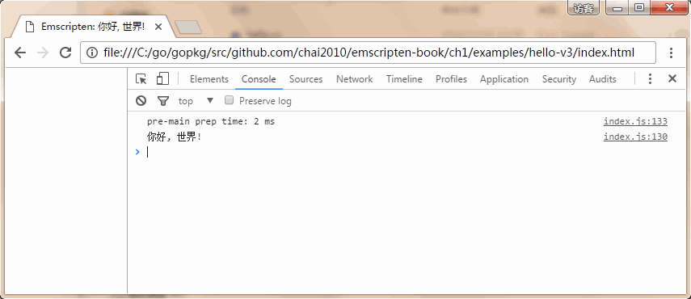 <!-- .element: style="width:100%;" -->

---
### 你好, 世界! - 自动生成HTML
---------------------------

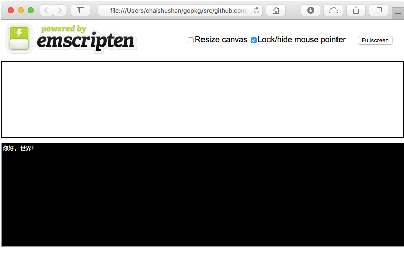 <!-- .element: style="width:100%; height:480px;" -->

```
emcc hello.cc -o hello.html
```

---
### 你好, 世界! - SDL模拟放大镜
----------------------------

<div style="width:480px; height:480px; margin:0 auto;">
	<a title="SDL模拟放大镜" href="examples/hello-again-v2/index.html" target="_blank">
		
	</a>
</div>

<div style="text-align:center;">
	<a href="http://codegolf.stackexchange.com/questions/35569/tweetable-mathematical-art">
		Tweetable Mathematical Art
	</a>
</div>

---
### 你好, 世界! - 浏览器调试C语言
-----------------------------

<div style="width:80%; height:480px; margin:0 auto;">
	<a title="SDL模拟放大镜" href="examples/c4" target="_blank">
		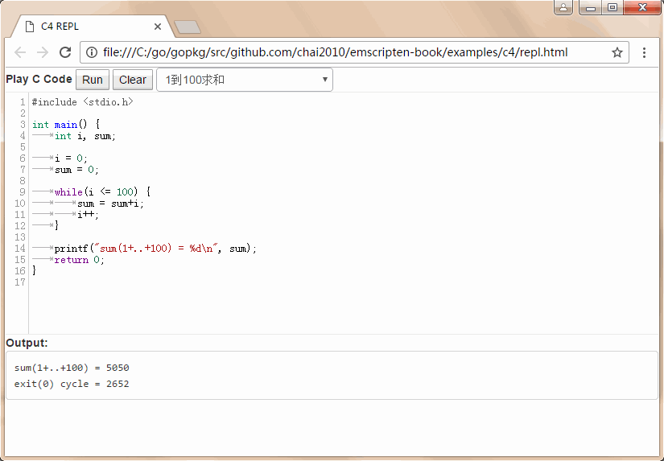
	</a>
</div>


<!-- ++++++++++++++++++++++++++++++++++++++++++++++++++++++++++++++++++++++  -->
***

## C语言支持
-----------

```c
#include <emscripten.h>

int main() {
	// Call JS from C
	emscripten_run_script("alert('hello!')");
	return 0;
}
```

`emscripten_run_script` 直接运行JS脚本

---
### EM_ASM: C语言内嵌JS代码
-------------------------

```c
#include <emscripten.h>

int main() {
	EM_ASM(
		alert('hello world!');
		throw 'all done';
	);
	return 0;
}
```

```c
EM_ASM_({
	Module.print('I received: ' + $0);
}, 100);
```

```c
int x = EM_ASM_INT({
	Module.print('I received: ' + $0);
	return $0 + 1;
}, 100);
printf("%d\n", x);
```

---
### JS字符串转C字符串
------------------

```js
var buf = Module._malloc(myTypedArray.length*myTypedArray.BYTES_PER_ELEMENT);
Module.HEAPU8.set(myTypedArray, buf);
Module.ccall('my_function', 'number', ['number'], [buf]);
Module._free(buf);
```

---
### 调用JS函数(A)
----------------

```js
// myLib.js
mergeInto(LibraryManager.library, {
	js_func: function(x) { alert('you sent ' + x) }
});
```

```c
// main.c
void js_func(int x);

int main() {
	js_func(3); // will cause alert('you sent 3')
	return 0;
}
```

```
emcc main.c --js-library myLib.js
```

---
### 调用JS函数(B)
----------------

```js
function _js_func(x) { // from JavaScript library
	alert('you sent ' + x);
}

function _main() { // compiled from C
	_js_func(3);
	return 0;
}
```

---
### 调用C函数
------------

```c
// C file that was compiled to JS
int c_add(int x, int y) { return x+y; }
```

```js
// Call C from JS
var result = ccall(
	'c_add',              // c function name
	'number',             // return type
	['number', 'number'], // argument types
	[10, 20]              // arguments
);
// returns 30
```

---
### 导出C函数
------------

```js
// Call C from JS
var c_add = cwrap(
	'c_add',              // c function name
	'number',             // return type
	['number', 'number']  // argument types
);

console.log(c_add(10, 20)); // 30
console.log(c_add(20, 30)); // 50
```

---
### 内存模型
-----------

```js
var buffer = new ArrayBuffer(32768);
var HEAP8  = new Int8Array(buffer);
var HEAP16 = new Int16Array(buffer);
var HEAP32 = new Int32Array(buffer);

function mem_get() {
	return HEAP32[HEAP8[100] >> 2];
}

function mem_set(ptr) {
	HEAP[ptr] = 12;       // write to an address
	return HEAP[ptr + 4]; // read from an address
}
```

指针对应buffer数组的索引, 是一个整数

不能直接访问JS空间的数组数据

---
### 警告: 未定义行为
-------------------

```c
char buffer[8];
int *i = (int*)&buffer[1]; /* unaligned! */
*i = 10;
```

指针没有对齐, X86可以工作, ARM环境可能错误

JS环境错误(SAFE_HEAP可以, 但是性能很低)


<!-- ++++++++++++++++++++++++++++++++++++++++++++++++++++++++++++++++++++++  -->
***

## EMBIND: C++支持
------------------

```c++
// Access JS objects in C++ like C++ objects
#include <emscripten/val.h>

using namespace emscripten;

int main() {
	val Math = val::global("Math");
	return Math.call("abs", -10); // returns 10
}
```

---
### 导出C++函数
--------------

```c++
// quick_example.cpp
#include <emscripten/bind.h>

using namespace emscripten;

float lerp(float a, float b, float t) {
    return (1 - t) * a + t * b;
}

EMSCRIPTEN_BINDINGS(my_module) {
    function("lerp", &lerp);
}
```

```
emcc --bind -o quick_example.js quick_example.cpp
```

```html
<!doctype html>

<script src="quick_example.js"></script>
<script>
	console.log('lerp result: ' + Module.lerp(1, 2, 0.5));
</script>
```

---
### 导出C++函数
--------------

```c++
// C++ library
#include <emscripten/val.h>

using namespace emscripten;

int c_add(int a, int b) { return a+b; }

EMSCRIPTEN_BINDINGS(my_module) {
	function("c_add", &c_add);
}
```

```js
// Use it in JS
alert(Module.c_add(10, 20)); // shows 30
```

---
### 导出C++类
------------

```c++
// C++ class wrapped by Embind
class Cat {
	string name;
public:
	Cat(string name_) : name(name_) {}
	void meow() { printf("%s meows\n", name.c_str());
};

// much like Boost.Python...
EMSCRIPTEN_BINDINGS(Cats) {
	class_<Cat>("Cat")
	.constructor()
	.function("meow", &Cat::meow);
}
```

```js
// JavaScript
var myCat = new Module.Cat("Fluffy");
alert(myCat.meow()); // shows "Fluffy meows"

// ...

myCat.delete()
```


<!-- ++++++++++++++++++++++++++++++++++++++++++++++++++++++++++++++++++++++  -->
***

## 消息循环(A)
-------------

```c
int main() {
	init();
	while(is_game_running()) {
		do_frame();
	}
	return 0;
}
```

---
### 消息循环(B)
-------------

```c
#include <emscripten.h>

void do_web_frame() {
	if(!is_game_running()) {
		emscripten_cancel_main_loop();
		return;
	}
	do_frame();
}

int main() {
	init();
	emscripten_set_main_loop(do_web_frame, 0, 0);
	return 0;
}
```

---
### 消息循环: HTML5
------------------

```c
#include <emscripten.h>
#include <emscripten/html5.h>

int main() {
	emscripten_set_canvas_size(1024, 768);
	emscripten_set_keydown_callback(0, 0, 1, key_callback);

	emscripten_set_main_loop(do_web_frame, 0, 0);
	return 0;
}
```

---
### 消息循环: SDL
----------------

```c
#include <SDL.h>
#include <emscripten.h>

int main() {
	SDL_Init(SDL_INIT_VIDEO);
	SDL_Surface* screen = SDL_SetVideoMode(1024, 768, 32, SDL_HWSURFACE);

	// 在 do_web_frame 中通过 SDL_PollEvent 获取输入消息
	emscripten_set_main_loop(do_web_frame, 0, 0);
	return 0;
}
```

---
### 消息循环: GLES 2.0
---------------------

```c
void do_web_frame() {
	// normal GLES 2.0 code, no clientside data
	glClear(GL_DEPTH_BUFFER_BIT);
	glBindBuffer(GL_ARRAY_BUFFER, ab);
	glBindBuffer(GL_ELEMENT_ARRAY_BUFFER, eb);
	glVertexAttribPointer(1, 3, GL_FLOAT, GL_FALSE, 24, 0);
	glUseProgram(p);

	// ...
	glDrawArrays(GL_TRIANGLE_STRIP, 0, n);
	// ...
}
```

---
### 异步调用
-----------

JavaScript:

```js
setTimeout(function() {
	// ...
}, 1000);
```

C++闭包函数:

```c++
emscripten_async_call([](void* arg) {
	// ...
}, arg, 1000);
```


<!-- ++++++++++++++++++++++++++++++++++++++++++++++++++++++++++++++++++++++  -->
***

## 调式信息
----------

`-g0` 禁止输出调试信息, `-O1` 以上优化默认选项

```js
function a(a,b){a=a|0;b=b|0;f(a+b|0);}
```

`-g1` 保留格式化输出:

```js
function a(a, b) {
  a = a | 0;
  b = b | 0;
  f(a + b | 0);
}
```

`-g2` 保留函数名称:

```js
function _addAndPrint(a, b) {
  a = a | 0;
  b = b | 0;
  _printAnInteger(a + b | 0);
}
```

---
### 调式信息
-----------

`-g3` 或 `-g` 保留函数名和变量名:

```js
function _addAndPrint($left, $right) {
  $left = $left | 0;
  $right = $right | 0;
  _printAnInteger($left + $right | 0);
}
```

`-g4` 保留映射表, 可以定位到 C/C++ 代码.

---
### 调式信息
-----------

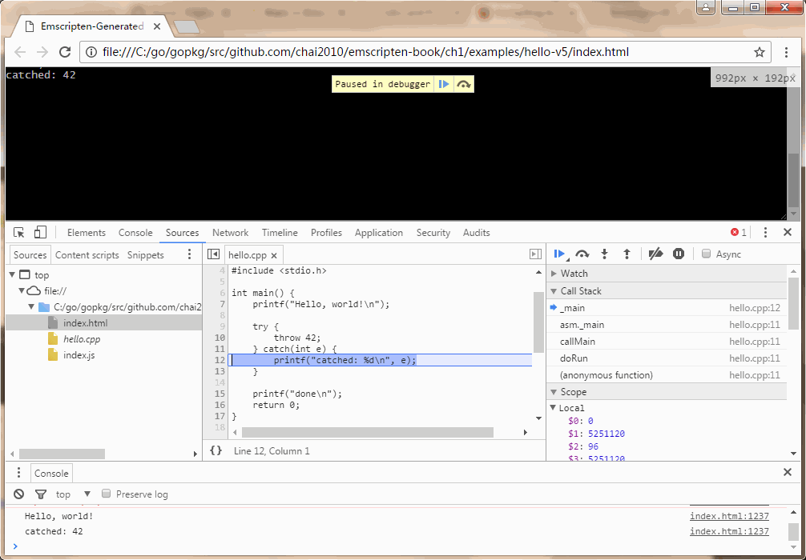 <!-- .element: style="width:100%; height:560px" -->

<!-- ++++++++++++++++++++++++++++++++++++++++++++++++++++++++++++++++++++++  -->
***

## ASM.js
----------

```js
function strlen(ptr) {
	ptr = ptr|0;
	var curr = 0;
	curr = ptr;
	while(MEM8[curr]|0 != 0) {
		curr = (curr + 1)|0;
	}
	return (curr - ptr)|0;
}
```

`a = a|0` 等价于 `var a int`, 指明 `a` 是一个32bit的整数

指针 `ptr` 只是内存数值 `MEM8` 的索引, 是一个32bit整数

----

ASM.js 是 JavaScript 汇编语言, 采用 C 语言编程模型

---
### ASM.js: 生成机器码
--------------------

```js
function f(i, j, k) {
	i = i|0;
	j = j|0;
	k = k|0;
	return (((i + j) & k) + j)|0;
}
```

```asm
add  %esi,%edi
and  %edx,%edi
mov  %edi,%eax
add  %esi,%eax
retq
```

---
### ASM.js: 类型
---------------

普通变量根据初始值确定数据类型:

```js
var d = 3.14; // d : double
var e = 0.0;  // e : double
              
var i = 42;   // i : int
var j = 0;    // j : int
```

函数参数用特殊写法明确类型:

```js
function f(d, i) {
	d = +d;   // d : double
	i = i|0;  // i : int
	...
}
```

---
### ASM.js: 类型转换
-------------------

```js
function f(d, i) {
	d = +d;    // d : double
	var i = 0; // i : int

	// i = d;  // type error
	i = ~~d;   // ~~ : double -> int
	d = +i;    //  + : int -> double
}
```

---
### ASM.js: 类型必须匹配
----------------------

```js
// f : int -> void
function f(i) {
	i = i|0;
}

function g() {
	var d = 3.14;  // d : double
	var i = 42;    // i : int

	// f(d);       // type error
	f(i);
}
```

Firefox 下 f 函数调用对应以下汇编代码:

```
mov    $0x2a,%edi
callq  <f>
```

---
### 数学运算
-----------

```
          +,- : (int, int) -> intish  OR
                (double, double) -> double

|,&,^,~,<<,>> : (intish, intish) -> signed
            ~ : intish -> signed
          >>> : (intish, intish) -> unsigned
```

intish 为 JavaScript 数值类型, 使用前必须转型

---
### ASM.js: 模块
---------------

```js
// The outer function acts as a module
function asmModule(global, imports, heap) {
	// Hint to the JS engine that this is asm.js (does not change behavior):
	"use asm";

	// Module imports, callable from compiled functions
	var puts = imports.puts;

	// C++ functions are compiled into JS functions
	function main() {
		puts(8); // printf("Hello, World!\n");
	}

	// Module export, callable from outside code
	return { main:main };
}
```

---
### C => ASM.js (A)
-------------------

C++:

```c
int func(int *p) {
	int r = *p;
	return calc(r, r << 16);
}
```

asm.js:

```js
function func(p) {
	var r = HEAP32[p >> 2];
	return calc(r, r << 16);
}
```

---
### C => ASM.js (B)
-------------------

c++:

```c
float array[5000];
int main() {
	for (int i = 0; i < 5000; ++i) {
		array[i] += 1.0f;
	}
}
```

asm.js:

```js
var buffer = new ArrayBuffer(32768); // 32KB
var HEAPF32 = new Float32Array(buffer);
function main() {
	var a = 0, b = 0;
	do {
		a = (8 + (b << 2)) | 0;
		HEAPF32[a >> 2] = +HEAPF32[a >> 2] + 1.0;
		b = (b + 1) | 0;
	} while ((b | 0) < 5000);
}
```

---
### C++ => ASM.js: C++异常 (A)
------------------------------

C++:

```c++
void func() {
	try {
		something();
	} catch(Type T) {
		handle(T);
	}
}
```

ASM.js:

```js
function func() {
	invoke(10); // call a function pointer, checking for throw
	var T = get_thrown();
	if(T) {
		if(can_handle(T, 400)) { // 400 -> typeid of Type
			handle(T);
		} else {
			do_throw(T);
		}
	}
}
```

---
### C++ => ASM.js: C++异常 (B)
-----------------------------

```js
function invoke(ptr) {
	__thrown__ = 0;
	try {
		dyn_call(ptr);
	} catch(e) {
		__thrown__ = e;
	}
}
function can_handle(ptr, type) {
	// call into libc++abi internals
}
function do_throw(ptr) {
	throw ptr;
}
```

基于JS异常实现, 然后进行栈拆包

---
### ASM.js => WebAssembly (A)
-----------------------------

```js
function () {
	"use asm";
	function add(x, y) {
		x = x | 0;        // | 0  =>  int32
		y = y | 0;
		return x + y | 0; // int32 addition!
	}
	return { add: add };
}
```

```
$ bin/asm2wasm test/hello_world.asm.js
```

https://github.com/WebAssembly/binaryen

---
### ASM.js => WebAssembly (B)
-----------------------------

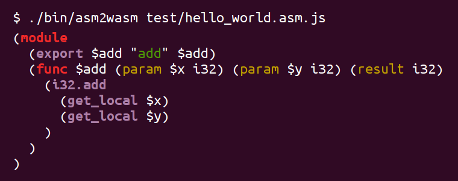 <!-- .element: style="width:100%;" -->

https://github.com/WebAssembly/binaryen


<!-- ++++++++++++++++++++++++++++++++++++++++++++++++++++++++++++++++++++++  -->
***

## JavaScript性能
----------------

#### JavaScript 目前是地球上最快的脚本语言, 感谢 V8 引擎

#### 比 Python/Ruby 之流快 10~100 倍, 或更多

#### 比 Lua/LuaJIT 快 2 ~ 10 倍

#### 比 C/C++ 慢 1 ~ 10 倍

---
### JS性能优化：JIT技术
--------------------

```js
// 实践中, x 是较小的整数
function sum(x) {
	var s = 0;

	// 实践中, i 是较小的整数
	for (var i = 1; i < x; i++) {
		s += i;
	}
	return s;
}
```

---
### JS性能优化: TypeArray
------------------------

```js
// 带类型的数组, 性能和原生程序一样快
var heap = new Int32Array(10240);

function sumArray(x) {
	var s = 0;
	for (var i = 0; i < x; i++) {
		s += heap[i]; // fast read of int32
	}
	return s;
}
```

TypeArray 可以直接对应物理内存模型

---
### JS性能优化: 浮点数?
---------------------

```js
var floats = new Float32Array(calc());
floats[0] = floats[1] + floats[2] + 1; // 虽然是 float, 但是依然用 double 计算
floats[1] = floats[0] + floats[2] + 1;
floats[2] = floats[1] + floats[2] + 1;
```

`Math.fround` 明确表达式的精度, 可优化为 float 运算:

```js
var floats = new Float32Array(calc());
floats[0] = Math.fround(floats[1] + floats[2]) + 1;
floats[1] = Math.fround(floats[0] + floats[2]) + 1;
floats[2] = Math.fround(floats[1] + floats[2]) + 1;
```

JavaScript 只有 double 一种数值类型

---
### JS性能优化: SIMD 指令
-----------------------

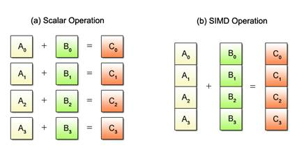 <!-- .element: style="width:100%; height:300px;" -->

```js
// 采用 SIMD 并行指令加速运算
var x = float32x4(1, 2, 3.14159, 22.5);
var y = float32x4(0, 0, 1, 0);
var z = SIMD.add(x, y);
```

用好 SIMD 指令, 可以秒杀 C/C++ 性能

---
### JS性能优化: ASM.js
---------------------

```js
function strlen(ptr) {
	ptr = ptr|0;
	var curr = 0;
	curr = ptr;
	while(MEM8[curr]|0 != 0) {
		curr = (curr + 1)|0;
	}
	return (curr - ptr)|0;
}
```

`a = a|0` 等价于 `var a int`, 指明 `a` 是一个32bit的整数

指针 `ptr` 只是内存数值 `MEM8` 的索引, 是一个32bit整数

----

ASM.js 是 JavaScript 汇编语言, 采用 C 语言编程模型

---
### JS性能优化: WebAssembly
---------------------------

 <!-- .element: style="width:100%;" -->

是 Web 汇编语言字节码, 将是一个通用的目标平台

https://github.com/WebAssembly/binaryen


<!-- ++++++++++++++++++++++++++++++++++++++++++++++++++++++++++++++++++++++  -->
***

## 2018: WebAssembly 1.0
------------------------

- 2018.07 - WebAssembly 发布1.0规范
- 2018.08 - Go1.11开始试验性地⽀持WebAssembly
- 2018.08 - Windows2000 运⾏在浏览器中
- 2018年诞⽣了诸多WASM开源项⽬
- 2018下半年, 5~10本WebAssembly书
- WASM的各种新闻井喷……


---
### Windows 2000 on WebAssembly
-------------------------------

####  <!-- .element: style="width:70%;" -->

#### https://bellard.org/jslinux/

---
### Ending定律
-------------

#### Ending's law: "Any application that can be compiled
#### to WebAssembly, will be compiled to WebAssembly
#### eventually."

------

#### Ending在2016年Emscripten技术交流会上给出断⾔：
#### 所有可以⽤WebAssembly实现的终将会⽤
#### WebAssembly实现。

---
### WebAssembly资料
------------------

#### 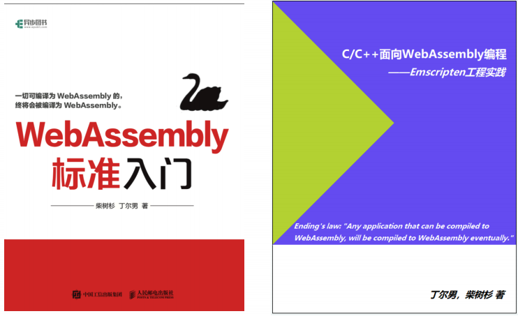 <!-- .element: style="width:80%;" -->

#### https://github.com/chai2010/awesome-wasm-zh

<!-- ++++++++++++++++++++++++++++++++++++++++++++++++++++++++++++++++++++++  -->
***

## 参考资源
----------

#### http://emscripten.org

#### https://github.com/kripken/emscripten

#### https://github.com/kripken/emscripten/wiki

#### http://asmjs.org

#### http://webassembly.org

<!-- ++++++++++++++++++++++++++++++++++++++++++++++++++++++++++++++++++++++  -->
***

## Thank you

#### [https://github.com/chai2010](https://github.com/chai2010)

#### [chaishushan@gmail.com](https://github.com/chai2010)

<!-- ++++++++++++++++++++++++++++++++++++++++++++++++++++++++++++++++++++++  -->
